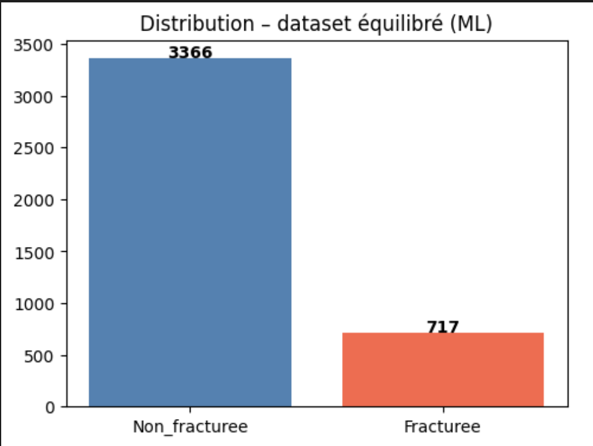
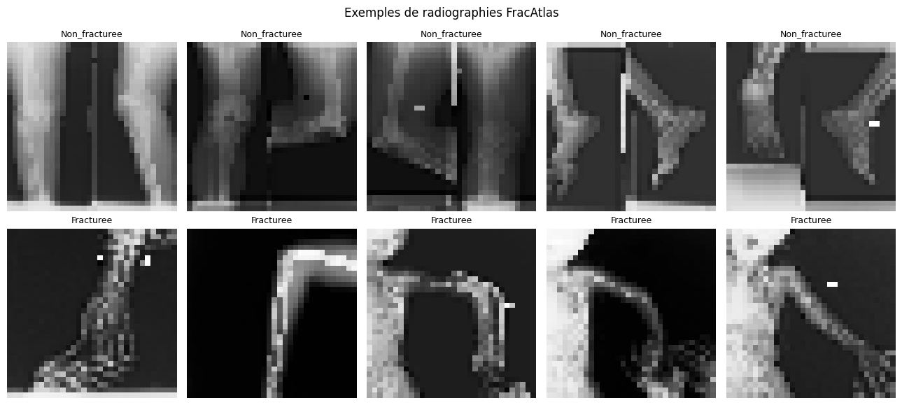
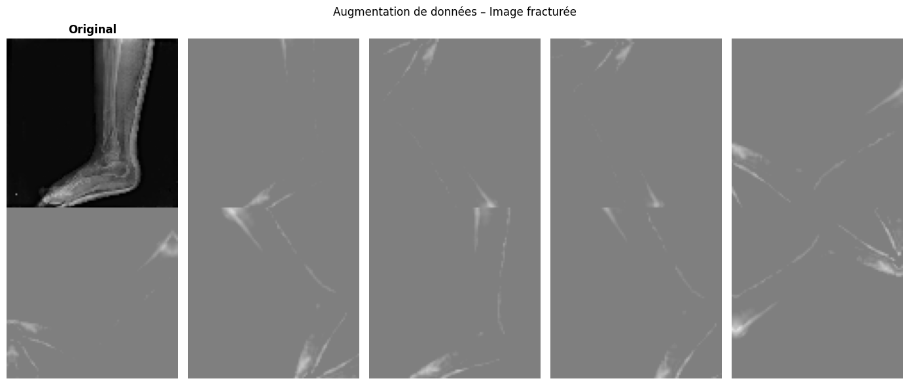
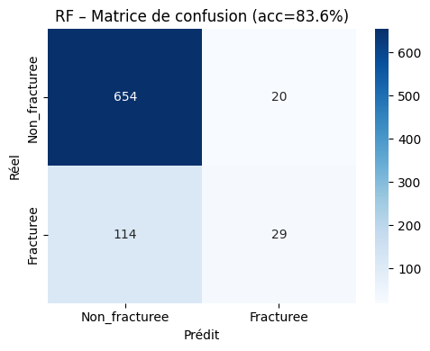
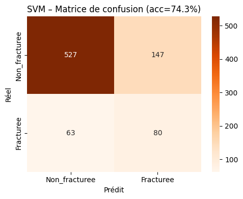
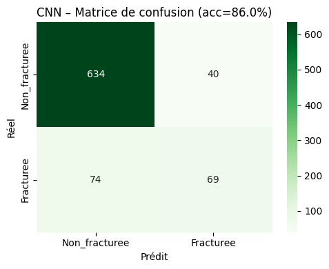
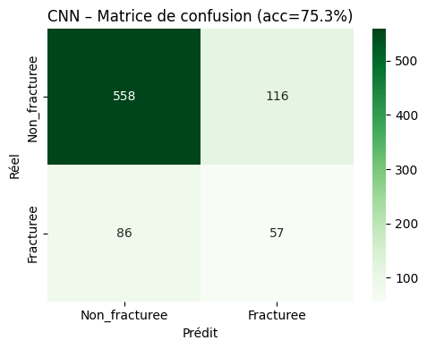
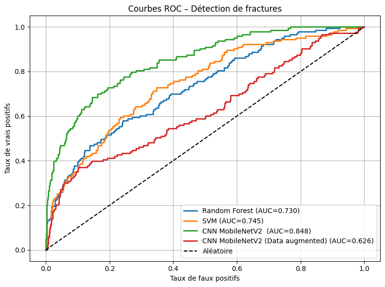

# Rapport — Détection de fractures osseuses (FracAtlas)

**Projet IA02 — Classification non linéaire grâce à l'IA avancée**
**Auteurs :** Yves CHEKOUA, Mohamed Mehdi TRABELSSI — UTT, SN2

## 1. Contexte et enjeu

La détection de fractures osseuses sur des images radiographiques nécessite normalement l'intervention d'un radiologue. L'automatisation de cette détection par un algorithme de classification binaire permettrait de pallier le manque de professionnels disponibles, en particulier dans les situations d'urgence. L'enjeu médical impose une exigence forte : **minimiser les faux négatifs** (fractures non détectées), ce qui oriente le choix des métriques d'évaluation vers l'AUC-ROC plutôt que la seule exactitude.

## 2. Présentation du dataset

Le dataset **FracAtlas** contient **4 083 images** de radiographies, réparties en deux classes :

| Classe | Nombre d'images | Proportion |
|---|---|---|
| Non fracturée | 3 366 | 82,4 % |
| Fracturée | 717 | 17,6 % |

Le ratio de déséquilibre est d'environ **1:4,7**, une situation typique en contexte médical où les cas pathologiques sont naturellement minoritaires. **L'intégralité du dataset** est utilisée pour l'entraînement et l'évaluation, le déséquilibre étant compensé par pondération de classe plutôt que par sous-échantillonnage.

## 3. Préparation des données

| Algorithme | Résolution | Jeu de données |
|---|---|---|
| Random Forest & SVM | 32 × 32 | Dataset complet (4 083 images) |
| CNN MobileNetV2 | 96 × 96 | Dataset complet (4 083 images) |

Un split stratifié 80/20 (train/test) est utilisé pour conserver les proportions de classes dans chaque sous-ensemble. Le déséquilibre résiduel est compensé par :
- `class_weight='balanced'` pour le Random Forest et le SVM
- une pondération de classe manuelle `{0: 1,0 ; 1: 4,7}` pour le CNN

## 4. Augmentation de données

L'augmentation génère synthétiquement de nouvelles variantes des images existantes, ce qui est en théorie utile pour enrichir la classe minoritaire (fractures) sans données réelles supplémentaires.

**Transformations testées (intégrées au pipeline CNN, actives uniquement pendant l'entraînement) :**

- `RandomFlip` (horizontal et vertical)
- `RandomRotation` (±15 %)
- `RandomZoom` (±15 %)
- `RandomContrast` (±20 %)

Afin de mesurer l'impact réel de cette augmentation, **deux variantes du CNN MobileNetV2 ont été entraînées et comparées** : une sans augmentation, une avec. Les résultats (section 5.4) montrent que cette augmentation, telle que configurée, **dégrade** les performances.

## 5. Algorithmes comparés

### 5.1 Random Forest

Recherche d'hyperparamètres par `GridSearchCV` (3 folds), avec `class_weight='balanced'` et **scoring F1** (plus pertinent que l'exactitude pour des données déséquilibrées).

**Hyperparamètres retenus :** `n_estimators=200`, `max_depth=10`, `max_features='sqrt'`

| Métrique | Valeur |
|---|---|
| Exactitude (test) | 83,6 % |
| AUC-ROC | 0,730 |

### 5.2 SVM

Standardisation préalable des features (`StandardScaler`, indispensable pour le SVM), recherche sur `C ∈ {0,1 ; 1 ; 10}` et noyaux `{RBF, linéaire}`, avec `class_weight='balanced'` et scoring F1.

**Hyperparamètres retenus :** `C=1`, `kernel='rbf'`

| Métrique | Valeur |
|---|---|
| Exactitude (test) | 74,3 % |
| AUC-ROC | 0,745 |

### 5.3 CNN — Transfer Learning MobileNetV2 (sans augmentation)

Approche en deux phases (méthode *Freeze* puis *Fine-tuning*) :

- **Phase 1 (Freeze)** : base MobileNetV2 pré-entraînée gelée, seule la tête de classification binaire (`GlobalAveragePooling2D → Dense(64) → Dropout(0,4) → Dense(1, sigmoid)`) est entraînée (`lr = 1×10⁻³`)
- **Phase 2 (Fine-tuning)** : 30 dernières couches dégelées, taux d'apprentissage très faible (`lr = 1×10⁻⁵`)

| Métrique | Valeur |
|---|---|
| Exactitude (test) | **86,05 %** |
| AUC-ROC | **0,848** |

C'est le **meilleur modèle** de ce projet : le Transfer Learning surpasse les algorithmes ML classiques dès lors qu'il dispose d'un volume de données suffisant.

### 5.4 CNN — Transfer Learning MobileNetV2 (avec augmentation)

Architecture identique à la section 5.3, avec la couche d'augmentation de données (section 4) intégrée en amont du réseau.

| Métrique | Valeur |
|---|---|
| Exactitude (test) | 75,3 % |
| AUC-ROC | 0,626 |

**Ce résultat est nettement inférieur** à la variante sans augmentation (-10,8 points d'exactitude, -0,222 sur l'AUC-ROC).

## 6. Comparaison générale

| Algorithme | Exactitude | AUC-ROC |
|---|---|---|
| Random Forest | 83,6 % | 0,730 |
| SVM | 74,3 % | 0,745 |
| **CNN MobileNetV2** | **86,05 %** | **0,848** |
| CNN MobileNetV2 (Augmentation) | 75,3 % | 0,626 |

### Pourquoi l'augmentation de données dégrade-t-elle les performances ici ?

Ce résultat illustre une limite importante de l'augmentation de données : **toutes les transformations ne sont pas pertinentes pour tous les domaines**. Le `RandomFlip` vertical, en particulier, retourne l'image de haut en bas — une transformation déraisonnable pour une radiographie osseuse, où l'orientation anatomique (sens de l'os, position de l'articulation) porte une information diagnostique réelle. En appliquant cette transformation, le modèle est entraîné sur des images dont la sémantique ne correspond plus à des radiographies réalistes, ce qui brouille l'apprentissage des features discriminantes de la fracture plutôt que de l'enrichir.

Ce résultat souligne que l'augmentation de données doit être choisie avec une connaissance du domaine métier, et non appliquée de façon générique : un flip horizontal (gauche/droite) aurait été plus défendable qu'un flip vertical pour ce type d'image.

## 7. Difficultés rencontrées

- **Déséquilibre de classes** : sans traitement spécifique, un modèle peut atteindre une exactitude élevée (~82 %) en prédisant systématiquement « non fracturé ». La pondération de classe (`class_weight='balanced'`/manuelle) et l'usage de l'AUC-ROC comme métrique de référence ont permis d'éviter ce piège.
- **Choix de la métrique de scoring pour GridSearchCV** : l'exactitude seule aurait orienté la sélection d'hyperparamètres vers des modèles biaisés en faveur de la classe majoritaire ; le scoring F1 a été préféré pour le RF et le SVM.
- **Augmentation de données contre-productive** : la première intuition (plus d'augmentation = meilleure généralisation) s'est révélée fausse ici. Identifier que le `RandomFlip` vertical était la cause de cette dégradation a nécessité de comparer explicitement les deux variantes du CNN.

## 8. Conclusion

Sur le dataset FracAtlas complet, le **CNN MobileNetV2 sans augmentation** obtient les meilleures performances (86,05 % d'exactitude, AUC-ROC de 0,848), devant le Random Forest (83,6 % / 0,730) et le SVM (74,3 % / 0,745). Ce résultat confirme la supériorité du Transfer Learning lorsque le volume de données est suffisant. Le résultat le plus instructif de ce projet est cependant la **dégradation des performances induite par une augmentation de données mal choisie** (-10,8 points d'exactitude) : l'augmentation de données est un outil puissant, mais son efficacité dépend entièrement de la pertinence des transformations choisies au regard du domaine d'application.
